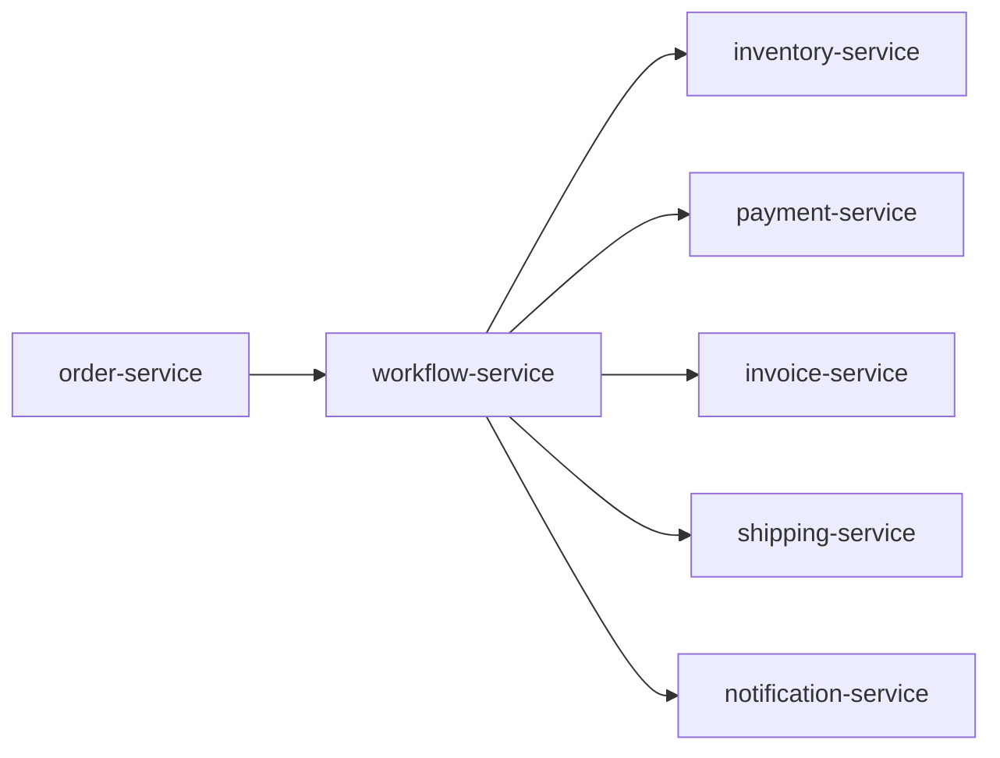

# Architecture

## System Context

The project models an order-processing system coordinated by a Camunda 7 workflow service.

## Service Boundaries

`order-service` owns orders. `inventory-service` owns stock and reservations. `workflow-service` owns Camunda process state and uses stable identifiers, mainly `orderId`, to query business data when a workflow step needs it.

## Data Ownership

Services do not access each other's database tables. Phase 2 adds Flyway migrations for orders, stock, and inventory reservations. Business services use in-memory H2 by default for local learning runs.

## Communication

Phase 2 uses synchronous REST:

- `order-service` calls `workflow-service` to start the order process with `orderId` and `correlationId`.
- `workflow-service` calls `order-service` to fetch order details for workflow steps.
- `workflow-service` calls `inventory-service` to reserve stock.

Later phases will introduce asynchronous RabbitMQ events.

## Saga Design

Saga compensation will be modeled after payment, inventory release, and shipping behavior exists.

